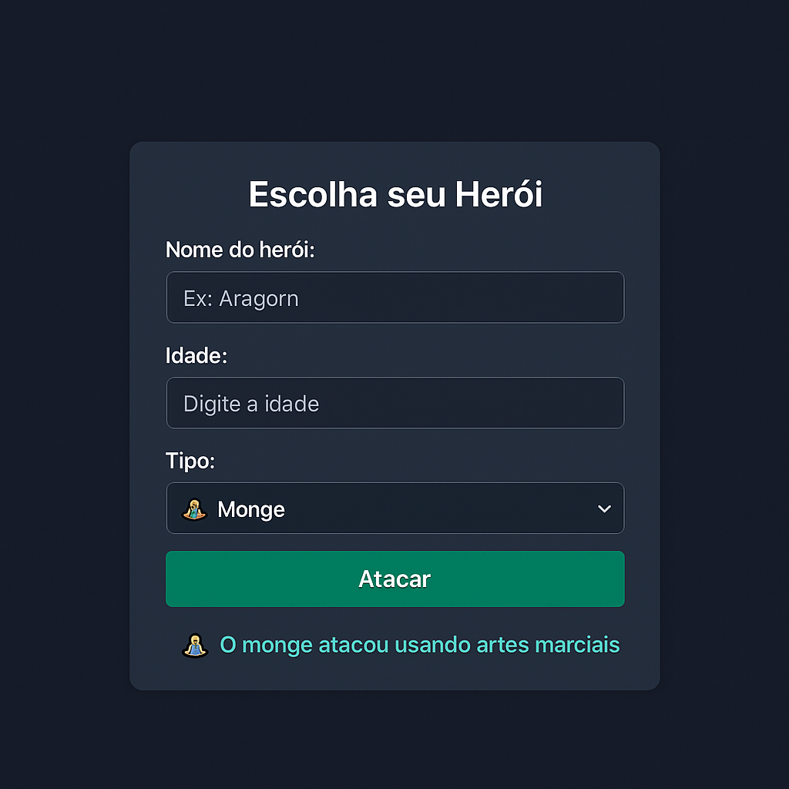

# 🛡️ Herói da Aventura 🧙‍♂️🧘🐱‍👤

Um projeto simples em HTML, CSS e JavaScript para simular heróis atacando conforme seu tipo. 
O usuário pode selecionar nome, idade e tipo de herói — mago, guerreiro, monge ou ninja — 
e ver o ataque correspondente com emoji!

## 🚀 Tecnologias Utilizadas

- HTML5
- CSS3
- JavaScript

## 📸 Prévia do Projeto




## ⚔️ Funcionalidades

- Entrada de nome e idade
- Seleção do tipo de herói
- Exibição do ataque com texto e emoji

## 🧠 Lógica do Ataque

Cada tipo de herói executa um ataque diferente:

| Tipo      | Emoji     | Ataque               |
|-----------|-----------|----------------------|
| Mago      | 🧙‍♂️✨     | Magia                |
| Guerreiro | 🛡️        | Espada               |
| Monge     | 🧘         | Artes marciais       |
| Ninja     | 🐱‍👤       | Shuriken             |

## 📂 Como usar

1. Clone o repositório:
```bash
git clone https://github.com/JRodriguess/saga-do-heroi.git
```

2. Abra o `index.html` em seu navegador.

## 📌 Autor

Feito com 💙 por [JRodriguess](https://github.com/JRodriguess)

---

✨ Construa, experimente e evolua seu portfólio com criatividade!
